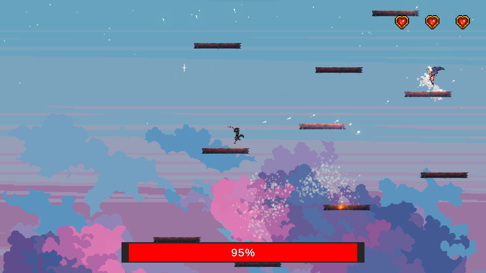
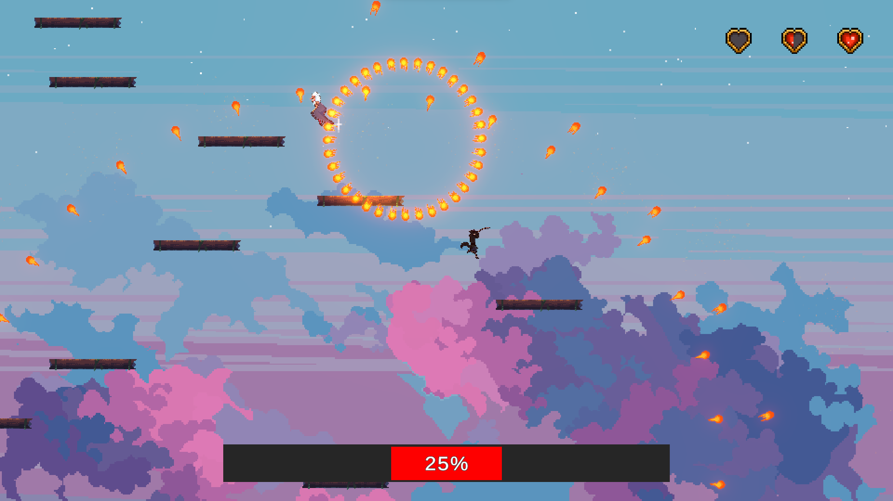

Pet проект (Unity 6000.0.13f1) 

# Демо-версия 2D Платформера

## Описание
Это демо-версия 2D платформера, в котором целью игры является — уничтожение врага, избегая при этом лавы, которая постепенно поднимается по уровню. Необходимо прыгать по платформам, чтобы не утонуть в лаве.

### Основное
- **Изменяющиеся уязвимости врага**: враг имеет три типа уязвимостей — к огню, воде и пару (сочетание огня и воды), которые постоянно меняются;
- **Атаки врага**: враг может атаковать огненными снарядами, и по мере уменьшения его здоровья, паттерны стрельбы становятся сложнее;
- **3 типа атаки у игрока**: ЛКМ - огонь, ПКМ - вода, ЛКМ + ПКМ - пар;
- **Рывок**: игрок может использовать рывок в полете с помощью кнопки shift;
- **Мелочи**: музыка; параллакс заднего фона и его затемнение по мере повышения высоты (эффект космоса); шейдеры для лавы и эффектов смерти игрока или врага; particle system для проджектайлов.

## Скриншоты

